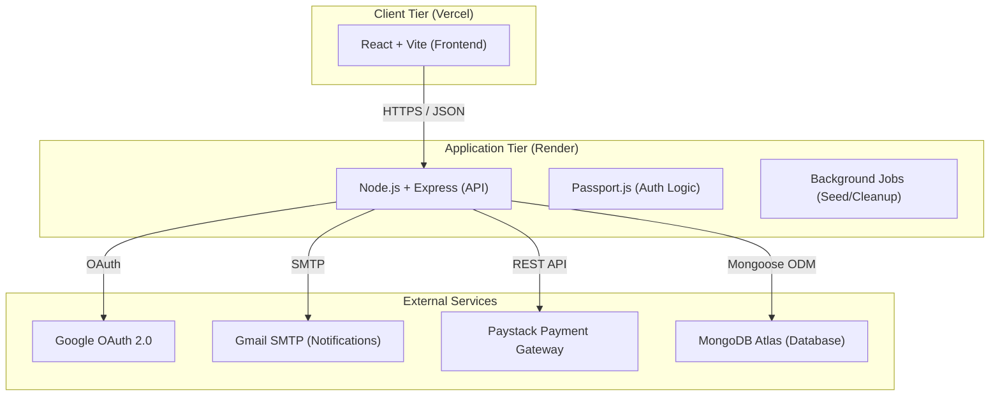
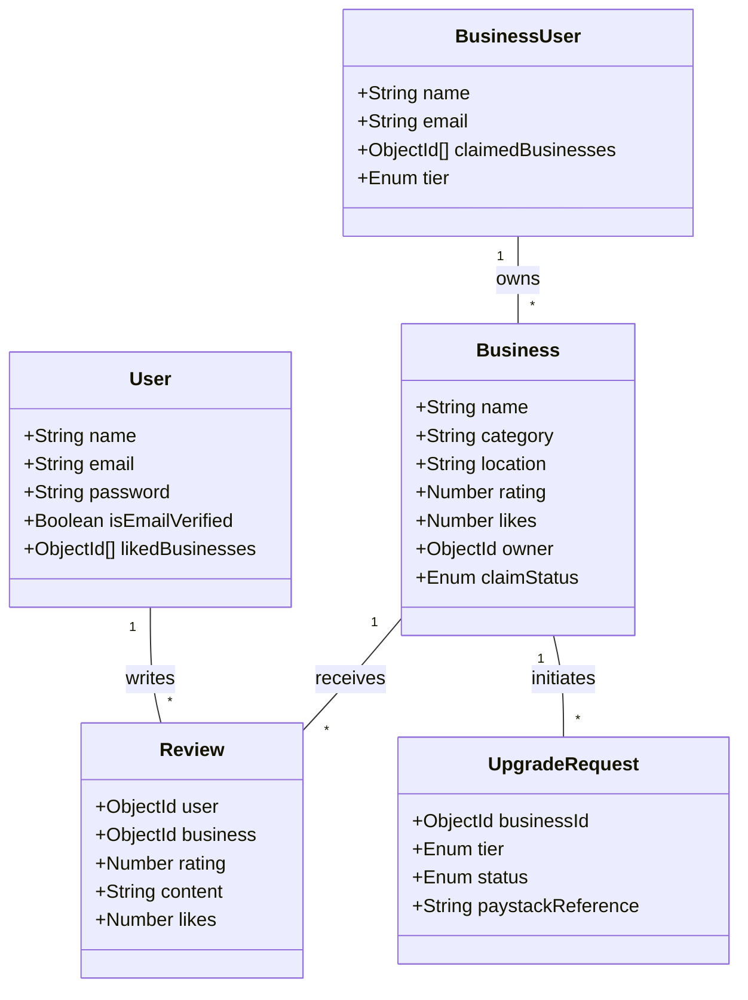
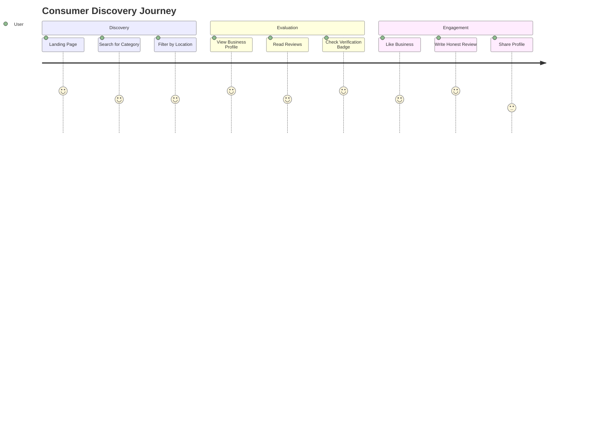
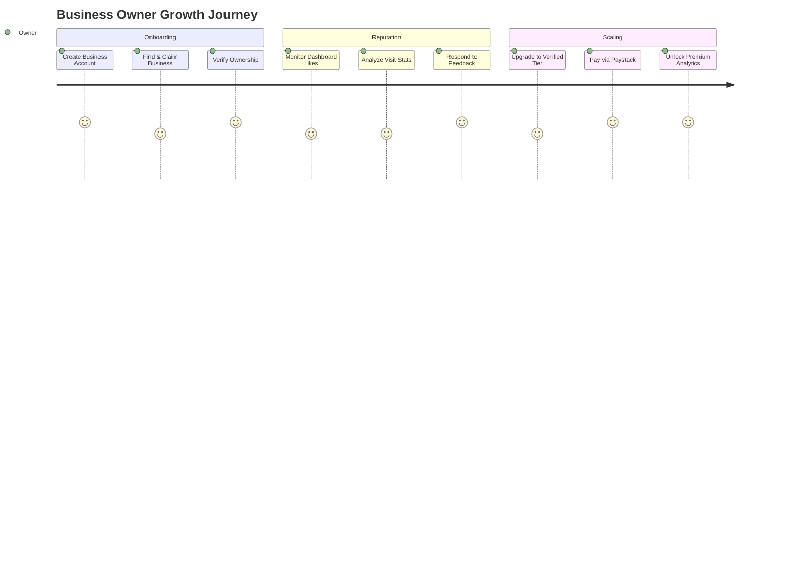

# NaijaTrust System Architecture

This document provides a technical overview of the NaijaTrust platform architecture, including high-level and low-level designs, as well as customer journey maps.

---

## 🏗️ High-Level Architecture

The NaijaTrust platform follows a modern full-stack architecture with a decoupled frontend and backend, using MongoDB as the primary data store and Render/Vercel for managed hosting.

---

## 🧩 Low-Level Component Architecture

Detailed view of the backend services and model relationships.

---

## 🛤️ Customer Journeys

### 1. Regular User Journey (Discovery & Trust)
The path for a consumer looking for reliable Nigerian businesses.

### 2. Business User Journey (Growth & Reputation)
The path for a business owner leveraging NaijaTrust to build credibility.

---

## 🔐 Security Architecture

- **Authentication**: JWT-based stateless authentication for API requests.
- **Privacy**: Passwords hashed using bcrypt; sensitive data stored in environment variables.
- **Communication**: TLS/SSL encryption for all data in transit.
- **Compliance**: Email verification requirement for consumers; ownership verification for businesses.
